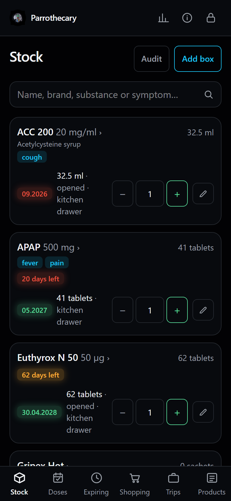
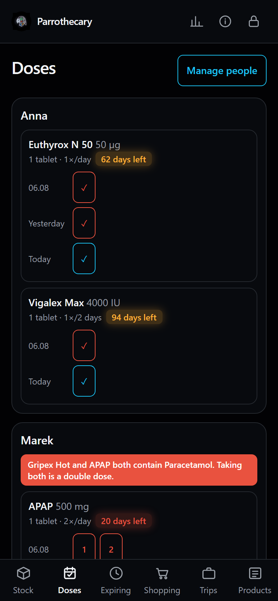
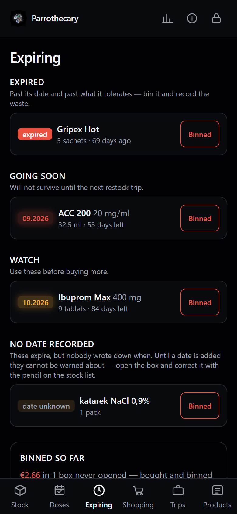
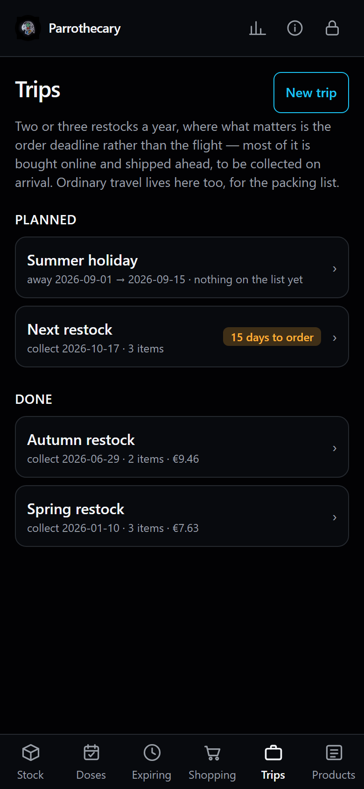
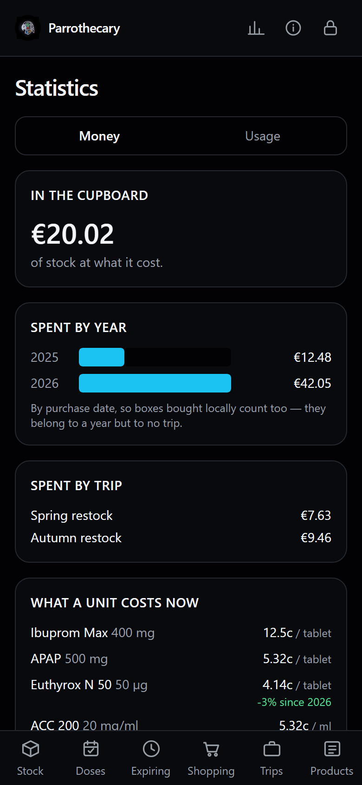
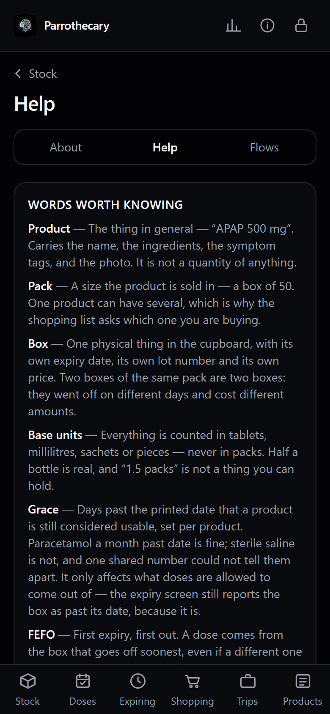

# Parrothecary

Domowa apteczka — a LAN-only home medicine and supplement inventory for one household.

Stock is restocked abroad two, sometimes three times a year, mostly ordered online and shipped
ahead of the visit. So this is less an inventory app than a **supply-planning** one: the hard
question is not "what do we have" but "will it last until the next trip, and what do we need to
order before the deadline".

## Status

**Phases 1 to 4 are done.** The cabinet is usable end to end: products, packs and boxes; stock and
expiry; barcode scanning; dose schedules and run-out projection; a stock ledger behind every
quantity that changes; counting the shelf; duplicate-ingredient warnings; alternatives; restock
trips with an order deadline and a cabinet audit; holidays with a packing list; prices, waste and
usage statistics; CSV export; and a help view that explains the lot.

**Phase 5 is deployment**, deliberately last — the app should be tested before it becomes the
thing the household relies on. Until then it runs locally against test data, which gets wiped for
a clean start on the day it is deployed.

## What it looks like

Phone-first, because that is where it gets used — standing at a cupboard, one hand free.

<p>
  
  
  
</p>
<p>
  
  
  
</p>

Shot against `npm run db:seed`, not real data.

## Getting started

```bash
npm install
```

Create `.env.local` from the example and generate a password:

```bash
npm run auth:hash -- "your master password here"
```

Paste the output **verbatim, including its backslashes**, into `.env.local`. Next's env loader
does shell-style variable expansion and an Argon2 hash is full of `$` signs; unescaped, it is
silently mangled and every login fails. Then:

```bash
npm run db:migrate
npm run dev
```

Open http://localhost:3000.

## Everyday commands

| Command | What it does |
| --- | --- |
| `npm run dev` | Development server |
| `npm run build` | Production build |
| `npm test` | Unit tests (domain logic) |
| `npm run typecheck` | TypeScript, no emit |
| `npm run db:migrate` | Apply pending migrations, taking a backup into `backups/before-migrate/` first |
| `npm run db:generate` | Generate a migration after editing `src/db/schema.ts` |
| `npm run db:studio` | Browse the database |
| `npm run db:symptoms` | Load the symptom tag vocabulary (run before any seed) |
| `npm run db:seed` | Load demo data (run `db:symptoms` first) |
| `npm run db:reset` | **Delete all data and every box photograph**, keep the schema (`-- --force` to skip the prompt) |
| `npm run db:check-ledger` | Verify every box agrees with its stock movements |
| `npm run db:backup` | Copy the database and the photographs into `backups/`, then verify the copy (`-- --keep-days=N --keep-months=N`) |
| `npm run db:restore -- <path>` | Put a backup back, from a folder or a downloaded zip. **Stop the app first** |
| `npm run auth:hash -- "…"` | Generate a master-password hash |
| `npm run audit:routes` | List routes and check each is behind the session guard (app must be running) |
| `npm run preflight` | Is this machine ready? Node, native modules, the password hash, folders, disk space |

Before entering real inventory, run `npm run db:reset` so no demo rows survive.

## The data model

Four layers, not two. Collapsing them — especially putting expiry on the product — makes the
app unfixable later without a migration.

| Layer | What it is | Example |
| --- | --- | --- |
| **Substance** | active ingredient | Ibuprofen |
| **Product** | branded concept + dose form | Ibuprom Max 400 mg tablets |
| **Variant** | a purchasable pack | box of 24 |
| **Batch** | a physical box in the house | bought 03/2026, exp 11/2027, 14 left |

Rules that must hold:

- **Expiry and price live on the Batch.** Two boxes of the same thing will differ.
- **Quantities are base units** (tablets / ml / sachets), never packs — half-used bottles are real.
- **Expiry is a full date**, with a `precision` flag so a box marked `11/2027` displays as
  `11/2027` rather than inventing a day. Month-only boxes store the last day of that month.
- **Expiry is nullable**, with a product-level `has_expiry` flag for plasters and thermometers.
- **Money is integer minor units** (grosze / cents), never floats, with the FX rate recorded at
  purchase so historical spend does not drift with the exchange rate.
- **Nothing is hard-deleted.** Products archive; batches get a terminal status. Consumption
  history is what makes the later phases possible.
- **Archiving a product hides the catalogue entry, not the stock.** Its boxes stay on the stock
  list and in the count, marked as archived, because you still physically have them — while it
  disappears from the products list and the "add box" picker. Blocking the archive until the
  stock ran out would mean binning usable medicine just to stop restocking something.
- **Every quantity change is recorded.** `stock_movements` holds one signed row per change, with
  a reason. Undo writes an opposite row rather than erasing the first, so a mistake and its
  correction are both on the record. The invariant — `sum(delta)` equals what is in the box, and
  zero once it leaves stock — is checkable with `npm run db:check-ledger`.

## Layout

```
src/
  domain/     Pure logic — no framework imports. Fully unit-tested.
  db/         Drizzle schema and the (lazy) SQLite connection.
  lib/        Auth, sessions, queries.
  app/        Routes. (app)/ is the authenticated area.
  components/ Shared UI.
e2e/          Playwright — owned by the repo owner. Page objects, fixtures, smoke and
              functional specs, with a setup project that logs in once and stores the session.
scripts/      Password hashing, seed, reset, ledger check.
docs/         Screenshots for this file.
```

`src/domain` deliberately imports nothing from Next. If the framework ever becomes a liability,
the shell can be replaced and the logic kept.

## Testing

Unit tests (Vitest) cover the domain modules — date arithmetic, expiry precision, pack
conversion, currency parsing, FEFO selection. These are where the subtle bugs live: date
maths across month boundaries, leap years and clock changes is a bug farm, and testing it
through a browser would be slow and brittle.

```bash
npm test
```

Browser and end-to-end tests live in `e2e/` and are written by the repo owner in Playwright.
Authentication is handled by a `setup` project that logs in once and saves the session to
`e2e/.auth/auth.json`, which every browser project then loads as its `storageState`.

```bash
npx playwright test
```

Note that in UI mode a dependency project is skipped unless it is ticked in the project filter,
so `setup` must be selected there or the stored session is never refreshed.

## Security

- Single master password, Argon2id, no user accounts.
- Sessions are server-side; the cookie holds a random token and the database stores only its
  SHA-256, so a leaked backup cannot mint a session.
- Failed logins are rate-limited per IP.
- **Do not expose this to the internet.** It is designed for the LAN, with remote access via
  the household VPN if needed.
- **A backup holds the cupboard, not the login.** `npm run db:backup` and the download button both
  copy the database and the photographs and deliberately leave `.env.local` alone, because a backup
  is a thing that ends up on memory sticks and in phone downloads. `MASTER_PASSWORD_HASH` is
  regenerated with `npm run auth:hash`, which is cheaper than copying a secret everywhere. The
  `restore.txt` inside a downloaded backup says so too, since that is where somebody will be
  standing when they find out.
- **The backup download is behind the session, not behind the proxy.** `/export/backup` checks the
  session in the handler like the CSV exports and the photo route, and answers a request without one
  with 404 rather than 401 — the proxy only knows whether a cookie is present, not whether it is
  valid, and an endpoint that hands out the whole database should not confirm it exists to a
  stranger.

## Deployment

Not yet done, but written down: **[`deploy/RUNBOOK.md`](deploy/RUNBOOK.md)** is the whole procedure
in order, with the systemd units and the Caddyfile beside it. Target is an unprivileged Debian LXC on
the household Proxmox host, behind Caddy with an internal CA (a trusted certificate is required for
camera access and home-screen install, both of which browsers block on plain HTTP).

The order in that runbook is the point: everything that can be got wrong cheaply happens while the
test data is still in place, the restore drill runs *before* there is anything to lose, and the wipe
is second to last. `npm run preflight` answers "is this machine ready" in one command — Node version,
the three native modules, the password hash as Next will actually read it, folders this user can
write, and room for the backup the timer is about to take.

Two things the deployment files settle rather than leave to be checked. Caddy is configured to
**overwrite** `X-Forwarded-For` rather than append to it: the login rate limit counts per IP and the
app reads the first entry, so appending would let a request choose its own identity and take as many
attempts as it liked. And the app binds to `127.0.0.1`, so port 3000 is unreachable from the network
even if the Caddyfile is wrong.

Updates are built and tested locally against a separate database, so production is never the place
anything is tried first. Migrations are forward-only, and `db:migrate` now takes a verified backup
into `backups/before-migrate/` before it runs and stops if that backup fails — the README promised
that from Phase 1, and until now nothing did it.

## Roadmap

- **Phase 1 — done.** The four-layer data model, products, packs and boxes, the stock list, the
  expiry view, the shopping list, and single-password auth.
- **Phase 2 — done.** PWA install, HTTPS, barcode scanning (EAN-13 plus GS1 DataMatrix, which
  carries expiry and batch on EU prescription packs), seeded medicines catalog, photos, and one
  search covering both names, manufacturer, active substance, symptom tag and barcode.
- **Phase 3 — done.** Household members, dose schedules with one-tap confirmation (daily or every
  N days), run-out projection, per-product expiry grace, Trips with an `order_by` deadline, the
  cabinet audit worksheet, and price history per product with trip and cupboard totals.

  The shopping list is *assisted*, not auto-generated: only four of fifteen products are on a dose
  schedule, so a list built purely from projections would speak for a quarter of the cabinet and
  stay silent about the plasters. The worksheet computes what it can and leaves the rest to a human
  once every six months, which is what the audit was always for.

  Waste tracking arrived here rather than in Phase 4, since the prices it needed were already
  present. It reports binned-unopened separately from what was left in opened packs — the first is
  money wasted, the second is the cost of having something available, and adding them together
  would flatter one and slander the other.
### Phase 4 — before deployment — done

Ordered as it was built. The database was still disposable, and stops being so the day the app is
deployed and real stock is entered — so anything that changed *what gets recorded* was cheapest
first, and anything that only reads it could wait.

1. **Stock ledger — done.** Every quantity change is an immutable row: batch, signed delta,
   reason (`received` / `dose` / `taken` / `adjust` / `binned` / `audit` / `opening`),
   timestamp. Before
   it, a tap on the minus button rewrote `quantity_remaining` and nothing recorded that it had
   happened, when, or why — only doses survived, in `dose_events`. Undo writes an opposite row
   rather than erasing the original, so a mistake and its correction are both on the record.

   The reasons distinguish three things that look identical in a database and are not: a tablet
   **taken** by hand off the stock list, a quantity **adjusted** because it was typed wrong, and
   a difference an **audit** count could not explain. Only the first is consumption. They shared
   one reason at first, which reported every unscheduled product — most of the cabinet — as never
   used at all, and could not be untangled afterwards because the distinction had never been
   written down.

   This is the foundation for everything below it, and the one item with a real deadline: a ledger
   cannot backfill history it never saw. It also replaces four separate features with one table —
   arbitrary date ranges, between-trip summaries, "start counting fresh" (an `opening` row, not a
   delete), and the audit below.
2. **Stock count — done.** Walk the cupboard, type what is actually in each box, and every
   difference lands as an `audit` movement. Correcting a miscount was already possible; what was
   missing was any record that it happened, and therefore any answer to how much stock quietly
   evaporates between counts. The page reports that running total back.

   Named "stock count" rather than "audit" because the trip page already calls its buying
   worksheet a cabinet audit, and the two ask opposite questions — that one asks what to buy,
   this one asks whether the shelf matches the app.

   Every field is optional: a blank box means "did not count this one". A cupboard gets counted
   in stages, and a form demanding all thirty numbers before accepting any would be abandoned
   halfway down the shelf. Rows that agree write nothing at all — agreement is not an event, and
   a row per box counted would bury the differences that are the point.
3. **Duplicate-substance warnings — done.** Two things containing the same active ingredient.
   Reaching for a headache tablet and a cold remedy an hour apart, both with paracetamol in
   them, is a double dose of something with a real ceiling, and nothing in the app said a word
   about it.

   Split deliberately into a fact and a warning, because most overlaps are neither dangerous nor
   interesting. A saline nasal gel and saline ampoules share sodium chloride and that is all they
   share — a cabinet that raises an alarm about those is one whose alarms get ignored. So the
   product page *states* what else contains the same ingredient, in passing and in muted text,
   while the Doses board *warns*, in red, only where two things are on the same person's
   schedule at once.

   Per person, never per household: two people each taking their own paracetamol is not a double
   dose, and flagging it would be both wrong and annoying.
4. **Alternatives between products — done.** What else would do when one has run out, on the
   product page, sorted so anything actually on the shelf comes first. Three relations:
   same active substance, local equivalent, works instead.

   Stored as one row per pair and read from both ends. Storing a direction and reading only that
   way is the version that goes half-linked — recorded on the paracetamol, missing from the
   ibuprofen, which is exactly the page you would be on when you needed it. Adding the same pair
   the other way round is refused rather than duplicated.

   Stock counts come from the same helpers every other screen uses, so an alternative is never
   offered out of a box the app would refuse to take a dose from.
5. **Travel kit — done.** See below.
6. **Thumbnail plus name in search — done.** Recognising a box by sight beats reading a foreign
   name, and the stock list already relied on it; search results returned text only. They now
   carry the same picture, and a product whose photo file has gone shows nothing rather than a
   broken image.
7. **Help view — done.** Two tabs alongside About, so the header gains no fourth icon.

   *Help* is a glossary, then one panel per screen, then two sections that matter more than the
   per-screen ones: **why won't it let me** — an index of every disabled control and the reason
   behind it, because from the outside each one reads as a fault — and **what it deliberately
   does not do**, because a decision looks identical to a gap unless somebody says otherwise.

   *Flows* is what happens between screens, which is where the surprises live: a tap in one place
   changes a number in another.

   Written as mechanisms rather than click-by-click instructions. A walkthrough is a lie waiting
   to happen — the first button that moves makes it wrong — while "doses come out of the box that
   expires first" survives any redesign. The audience is the person who was not in the room when
   these decisions were made.
8. **CSV export — done.** Three downloads from the Money page: boxes, stock movements, and the
   product catalogue. Together they are enough to rebuild the cabinet by hand if this app ever
   stops running. No dependencies; formatting is two clicks in a spreadsheet, which is why xlsx
   was dropped.

   Three files rather than one, because they answer different questions and a single sheet would
   repeat the product name on every row of the ledger. Boxes include the ones used up and binned:
   an escape hatch that quietly omits everything thrown away is a worse record than the database
   it came from. Every file starts with a byte-order mark — without one Excel reads UTF-8 as the
   local codepage and turns `Roztwór` and `µg` into mojibake.

   Served by a route handler rather than a server action, since an action cannot hand the browser
   a file, with the session checked in the handler the same way the photo route does it.
9. **Statistics: money — done.** Cupboard value, spend per year, spend per trip, what a unit
   costs now against the first time it was bought, and the waste split. Every figure has years
   of purchases behind it, so this half was meaningful the day it was built.

   A cross-product "which pack size is cheapest" section was dropped after checking the data:
   no product has ever been bought in two different pack sizes, so it would have rendered
   nothing. Price-per-unit over time replaced it, which the same data does support.
10. **Statistics: usage — done.** What moved per product over a chosen window, and what happened
   between one restock and the next. Reads the ledger rather than the purchase history, so it is
   the half that fills in as the app gets used.

   **Nothing here adds units across products.** Sixty tablets, thirty millilitres and one
   emergency blanket are not ninety-one of anything — units are only comparable within a product.
   The per-product table carries units; anything spanning the whole cabinet counts boxes and
   movements instead. Printing "316 units received" would have been easy and meaningless.

   Sections with nothing to show render nothing. No placeholder text explaining what the page is
   waiting for — this app has two users and both of them know.

End-to-end happy-path coverage runs alongside, per feature as each settles. Items 3, 4 and 6
barely move existing screens; item 1 changes what the stock buttons do underneath, so stock specs
should wait for it.

### Phase 5 — deployment

Deliberately last: the app should be tested before it becomes the thing the household actually
relies on, and this is the part that needs learning rather than reviewing.

Backups ship *with* it, not after. Deployment day is when real stock and fresh photos get entered,
and that data is valuable immediately — while today there is exactly one copy of the database on
one machine.

**A backup is the folder, not the file.** `VACUUM INTO` copies the database and nothing else, while
the box photographs sit beside it in `data/uploads` as ordinary files. A backup of the database
alone restores a cabinet whose every picture is missing — which is not hypothetical: a broken
thumbnail found during the bug hunt turned out to be exactly that shape.

**Done: `npm run db:backup`.** Writes `backups/2026-08-17T2311/` holding `parrothecary.db` and a
copy of `uploads/`, then checks what it wrote — that SQLite can read it, that the box and movement
counts match the original, that every box still passes the same `checkBox` rule the Audit screen
uses, and that every photograph the database refers to is actually in the folder.

Two kinds of problem, treated differently on purpose. If the **copy** cannot be trusted — unreadable,
short of rows, or the database had no schema to begin with — it is deleted rather than left looking
like a good one, and the run fails. If the **cupboard** has a fault the copy faithfully preserves —
boxes whose ledger does not add up, a photograph the database names that is not on disk — the backup
is kept and the fault is printed. Refusing to back up a cupboard because one thumbnail is missing
would mean a cosmetic fault costing every backup until somebody noticed, and it would throw away a
good backup over nothing whenever a photo happened to be replaced in the moment between copying the
database and copying the folder.

**What is kept is said in time, not in numbers.** Everything from the last 14 days, plus one backup a
month for the two months before that — `--keep-days=N` and `--keep-months=N`. Counting was the
obvious rule and the wrong one: "keep thirty" means a month of nightly backups and nearly four months
of twice-weekly ones, so the answer changes silently whenever the schedule does. The older monthly
copy is the one that matters on a bad day, because every recent backup is a faithful copy of a
cupboard that may already have been wrong for weeks. The rule lives in `src/domain/backup-name.ts`
and is tested there, since it decides what is gone forever; the script only does the deleting, and
never deletes a folder whose name it did not write. On the household's twice-weekly schedule this
leaves about seven folders, four megabytes. It is read-only on the live data, so it
can run while the app is serving — that is what `VACUUM INTO` buys over copying three files by
hand mid-write — and it exits non-zero, so a timer can tell.

Two environment variables matter: `DATABASE_PATH`, which the whole app already reads and which the
photographs are found relative to, and `BACKUP_DIR`, which defaults to `./backups` and is where to
point a different disk. A backup that lands on the same disk as the database survives a bad deploy
but not a dead drive, so that variable is the one that turns this from a safety net into a real
one.

Deployment day wires it to one, something like:

```ini
# /etc/systemd/system/parrothecary-backup.service
[Service]
Type=oneshot
WorkingDirectory=/srv/parrothecary
ExecStart=/usr/bin/npm run db:backup

# /etc/systemd/system/parrothecary-backup.timer
[Timer]
OnCalendar=daily
Persistent=true
```

**Done: a button, on Statistics.** "Download a backup.zip" builds the same thing in memory and hands
it over as one file: `parrothecary-backup-<stamp>/` holding the database, `uploads/`, and a
`restore.txt` saying what it is and how to put it back. Same snapshot method, same checks on the copy
before it is offered, same folder layout — so the restore below is the procedure for both.

The zip is written by hand in `src/lib/zip.ts`: a hundred lines of little-endian headers around
`zlib.crc32` and `zlib.deflateRawSync`, both of which Node ships. A dependency for this would have
been a dependency for four headers, the same reasoning that produced `src/lib/csv.ts`. The database
compresses to about a fourteenth (204 KB to 15 KB today); the photographs are already webp and come
out of the compressor a shade bigger, so they are stored as they are. Its output is checked against
three readers that did not write it — a byte-level reader in `zip.test.ts`, Windows Explorer, and
Python's `zipfile` — because a backup no other program can open is the kind of failure nobody finds
out about until the day it matters.

The script is the one that protects data, because the machine runs it whether anybody remembers or
not. The button is what gets a copy *off* the machine without a terminal — before a trip, or after
an evening of typing — and answers what was still open here until now: a backup on the same disk
survives a bad deploy, not a dead disk. It refuses above 64 MB rather than building something that
size in memory, and says to use the script instead; today's backup is under one.

**Restoring: `npm run db:restore`.** Stop the app first, then point it at either shape a backup
comes in — the folder the timer wrote, or the zip that went to a phone:

```sh
npm run db:restore -- backups/2026-08-17T2303
npm run db:restore -- ~/Downloads/parrothecary-backup-2026-08-17T2303.zip
```

This started as four documented steps and became a command because one of the steps fails silently.
Copying the database over `data/` while `parrothecary.db-wal` and `-shm` are still there does not
restore anything: SQLite replays that log on top of the file just put in place, the app comes back
showing the *pre-restore* cupboard, and `integrity_check` reports `ok` the whole way. Proved with
two throwaway databases rather than reasoned about. A clean shutdown usually checkpoints and removes
those files — but a machine that was killed, or lost power, is exactly the machine somebody is
restoring. A written instruction is a weak defence against a step whose omission looks like success.

What the command does, in this order: reads and checks the whole backup before touching anything
(every file's checksum, then the database's `integrity_check`, schema and counts); takes a backup of
what is about to be replaced, using `db:backup` so it is verified the same way as any other; clears
the stale log; puts both halves in place; then reads the result back and confirms it matches what the
backup held. A damaged or half-downloaded backup therefore costs nothing but the reading of it, and
restoring the wrong backup is itself undoable. On a machine with no database yet — the other reason
to run this — it skips the safety backup and says so.

That safety copy goes to `<BACKUP_DIR>/before-restore/`, in a folder of its own, and it is *checked*
rather than assumed. Both matter, and for the same reason: backups are named to the minute, and
`db:backup` treats a folder that already exists for this minute as "already done" — right for a timer
catching up, and quietly wrong here. Take a backup and then restore within the same minute, which is
exactly the careful order of work, and the safety copy was skipped while the restore reported
success: the cupboard being replaced went unrecorded. It now verifies that a folder was written by
this run and holds the counts the cupboard has right now, and refuses to restore otherwise. Two
restores inside one minute hit that refusal and are told to wait a minute — the safe end of the
trade.

It asks before overwriting, since it cannot tell whether the app is stopped: with WAL journalling an
idle connection holds no lock worth finding, so a running app looks exactly like a stopped one.
`--force` skips the prompt for scripted use.

Photographs are copied over rather than the folder being emptied first, so pictures taken since the
backup survive as orphans and are counted in the summary rather than deleted. `npm run db:reset` is
what clears that folder. Any photograph it could not write is listed and the command exits non-zero:
"the database is restored, the photographs are not all there" is a thing to be told, not to discover.

It reads the backslash-separated names PowerShell's `Compress-Archive` writes, because a backup
unpacked on a PC and zipped up again is exactly the hop between a phone and the machine, and that
round trip used to come back as a file the restore refused. Paths inside `uploads/` are kept as they
are rather than flattened onto the folder root.

Sign-ins live in the database, so they travel with a backup: a phone that signed in after it was
taken will be signed out afterwards. The command says so rather than leaving somebody at midnight
wondering whether the restore broke the login.

Afterwards: start the app, log in, and **open a product photo**. That is the test, because a picture
is the half a database-only backup loses silently.

The database is wiped for this: a clean start, entered fresh against the real cupboard. `db:reset`
takes the photographs with it, which it did not always — it deleted every row and left `uploads/`
alone, so pictures outlived the rows referencing them and no screen could show or remove them
again. Three such orphans were in the cabinet when the backup script started copying them into
every backup.

Statistics moved here from after deployment, where they were originally placed to let the ledger
accrue first. That reasoning was wrong: the database is wiped at deployment, so nothing recorded
beforehand survives and waiting buys nothing. What is genuinely time-dependent is narrower —
comparing one restock to the next needs two real restocks, and no amount of sequencing produces
those early.

### The travel kit, in more detail

A trip gains a `kind`: a restock, or ordinary travel. Ordinary travel opens a packing list.

Two things it is not. It does **not** share `shopping_items` — that table carries a purchase
lifecycle (`to_buy → ordered → arrived → in_stock`), while a packing line is "N units of this,
from this box". Same `trips` table, separate `travel_kit_items`. And it does **not** move stock
out of the cupboard, at first: that needs a "what came back" step which nobody performs while
actually travelling, and a forgotten return leaves the numbers worse than never having tried. The
ledger makes that upgrade a pair of reasons whenever the drift starts to matter.

Which leaves the doses actually swallowed while away, and the answer today is manual, because the
app is on the house network and a phone in another country is not. Nothing can be tapped at the
time, and the dose board only reaches back `max(3, interval + 1)` days, so a fortnight away cannot
be filled in retrospectively — the pills for those days are never drawn. The sequence on getting
home is therefore: confirm whatever the board still shows, then take the rest off with the stepper,
typing the whole amount in one press. That records `taken`, which is what happened. Counting the
box instead files the same units as `audit` drift, and that is only honest when the units really
are unaccounted for. Worth knowing before deciding the kit should move stock: the gap it would
close is one trip's worth of doses a couple of times a year, and it is closable by hand in a
minute.

What makes it more than a notes app is that the list arrives filled in. Active dose schedules must
come along and the app already knows how many — `unitsDueBetween` is unit-tested and is what the
audit worksheet uses, so twelve days away with one tablet daily packs twelve and says the box only
holds nine. Expiry is checked so nothing packed dies mid-trip. Symptom coverage is checked so the
bag is not missing a whole category.

**Settled:** it wants both, and it has both. Doses are recomputed from the trip length every
time — a course running while you are away contributes exactly the days it covers, worked out by
`unitsDueBetween`, the same function the restock worksheet uses. Standing items are a
`pack_for_travel` flag on the product, set once, because nothing can deduce that plasters belong
in a suitcase.

The two kinds share the trips table and nothing else. Everything about buying — the cost summary,
the cabinet audit, attaching shopping lines — belongs to a restock and is hidden from a holiday,
and the packing list is hidden from a restock; each worksheet redirects if reached by URL, and
each write refuses the wrong kind. The order-by midpoint and the "between restocks" windows both
count restocks only, so a holiday in the middle neither drags a deadline forward nor splits one
supply cycle into two meaningless halves.

A product that is both appears once, with the computed number: that is the more specific claim.
A standing item still appears in a week when none of its doses happen to be due, because "always
take the antihistamines" does not stop being true. Nothing is on the list until it is added — the
suggestions are offers, not decisions.

Two things the list says before the bag closes: when the amount wanted exceeds what is in the
cupboard, and when the box FEFO would reach for goes off before you get home.

### Deferred

Wanted, agreed, and deliberately not built. Written down because otherwise they exist only in
somebody's memory, which is how a small good idea quietly disappears.

- **Prescription renewal reminders.** Prescription products already carry a flag; nothing yet
  tracks when a script needs renewing, which is a different deadline from running out.

### Dropped

- **xlsx export** — a heavyweight dependency for formatting that takes two clicks in a spreadsheet.
  CSV instead.
- **Push notifications** — the app is used daily, so reminders would be noise, and they would have
  forced the first background scheduler into an app that deliberately derives everything on read.
- **Passkeys** — a session lasts 90 days from the login that created it, so "remember me" exists in
  all but name; a password manager covers the rest. (It does *not* slide forward with use, as this
  line claimed until 2026-08-15: expiry is fixed at login, so each phone signs in about twice a
  year however often it is opened. Sliding expiry would mean a database write on every request, for
  a login nobody minds doing at that interval.)
- **Audit log as a changelog** — who-changed-what has no audience in a two-person household. The
  reconciliation people actually mean by "audit" is item 2 above.

Not planned: a PL/EN interface toggle (dropped 2026-07-27 — the UI stays English, while product
*data* is bilingual through name/nameAlt and the Polish symptom tags), and anything paediatric.
